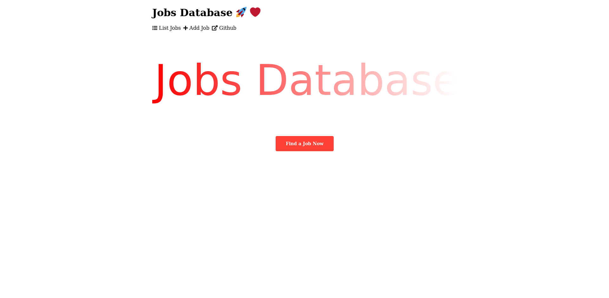
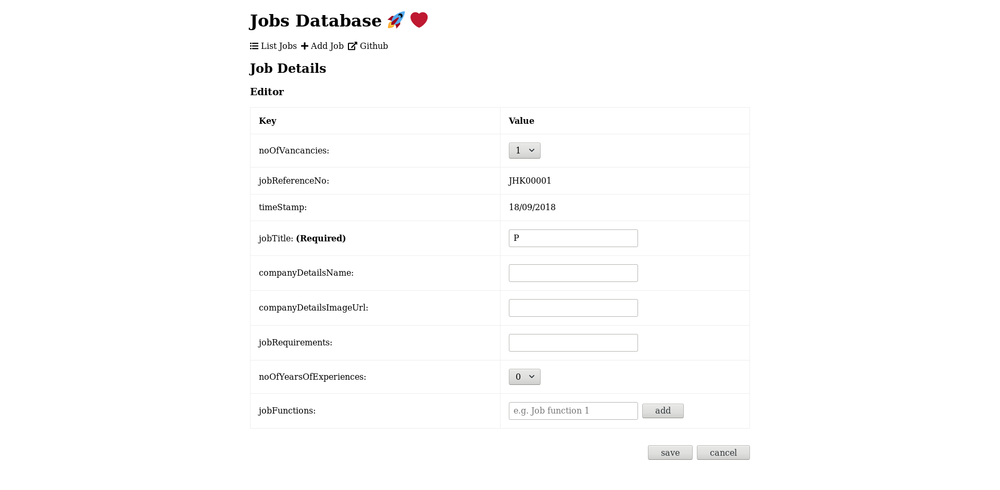
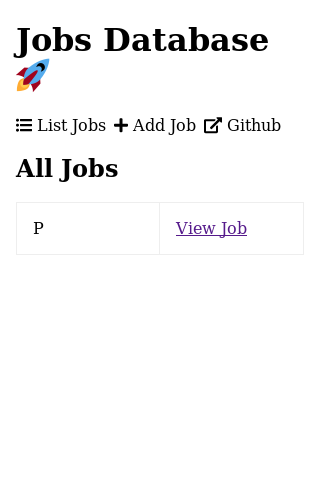
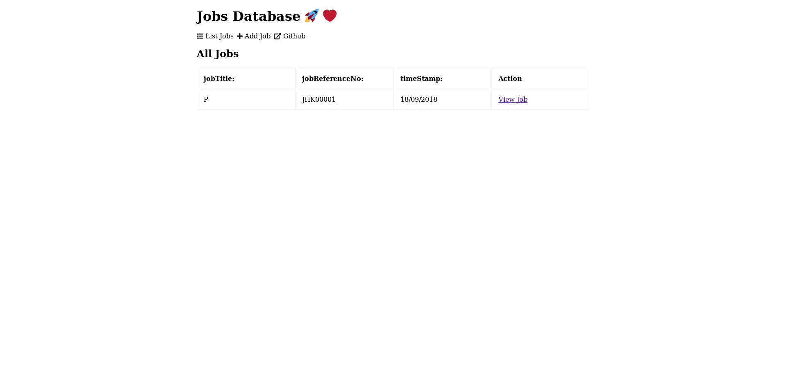

# Starberry Backend Development Assessment

[](https://travis-ci.com/whs-dot-hk/starberry-backend-development-assessment)
[](https://sbda-api.herokuapp.com/api/job)



Hi, welcome to my Mean stack project.
The demo is at
[https://demo1.whs.hk/](https://demo1.whs.hk/).

Table below is a summary of the
repositories and deployments details.

Name | Github Repository | Deployed to
--- | --- | ---
Frontend | [whs-dot-hk/sbda-angular](https://github.com/whs-dot-hk/sbda-angular) | Netlify
Backend | this repository | Heroku
MongoDB | no | mLab

## Introduction

This is a simplified jobs database written in Mean stack.
Functions include
showing a list of jobs,
adding a job,
edit a job and
delete a job.

The frontend is written in Angularjs.
Source code is uploaded to Github [whs-dot-hk/sbda-angular](https://github.com/whs-dot-hk/sbda-angular).
It is deployed to Netlify.
And is setup at [https://demo1.whs.hk/](https://demo1.whs.hk/).

The backend is written in Nodejs, Koa and Mongoose.
Source code is in this repository,
It is deployed to Heroku.
It is at [https://sbda-api.herokuapp.com/api/job](https://sbda-api.herokuapp.com/api/job).

Continue delievery is setuped on both frontend and backend repositories.

## Features

### Fully Mobile Responsive


### Simplicity



### Eye Candy

#### On Mobiles



#### On Desktops



## Dependences

* Angularjs
* Nodejs
* Mongoose
* Koa

## Schemas

### Job

Name | Type | Length | Default | Required | Remarks
--- | --- | --- | --- | --- | ---
noOfVancancies | Number | &ge;0 | No | Yes | Vancancies.
jobReferenceNo | String | &ge;0 | No | Yes | **Auto-generated**. The first Job is `JHK00001`, the second is `JHK00002`, etc.
timeStamp | Date | &ge;0 | No | Yes | **Auto-filled**.
jobTitle | String | &le;100 | No | Yes | Job title.
companyDetailsName | String | &le;100 | No | No | Company/Employer name.
companyDetailsImageUrl | String | &le;200 | No | No | Company/Employer image.
jobRequirements | String | &le;200 | No | No | Requirements
noOfYearsOfExperiences | Number | 0-10 | No | Yes | Year(s) of experiences
jobFunctions | [JobFunction] | &ge;0 | No | No | Job functions.

### JobFunction

Name | Type | Length | Default | Rquired | Remarks
--- | --- | --- | --- | --- | ---
name | String | &le;100 | No | Yes | Job function name.
jobs | [Job] | &ge;0 | No | No | Jobs under the job function.

### Instructions

#### Backend

```
$ git clone https://github.com/whs-dot-hk/starberry-backend-development-assessment.git
$ cd starberry-backend-development-assessment
$ yarn
$ yarn start
```

### Frontend

```
$ git clone https://github.com/whs-dot-hk/sbda-angular.git
$ cd sbda-angular
$ yarn
$ ng serve --open
```

You might want to change [line 17 of job service](https://github.com/whs-dot-hk/sbda-angular/blob/434952aa1cdab86e16726b338bd29b8a117e164c/src/app/job.service.ts#L17) to

```
private jobUrl = 'http://localhost:5000/api/job';
```

to use the Node server you just setuped.